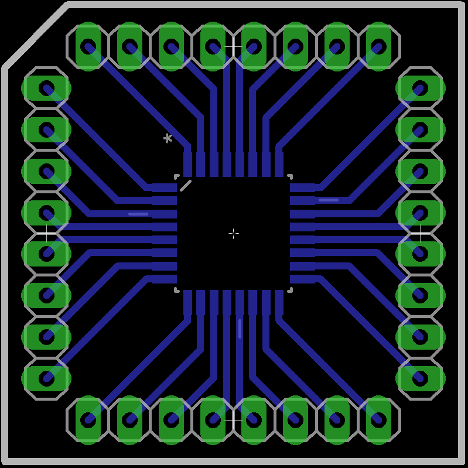
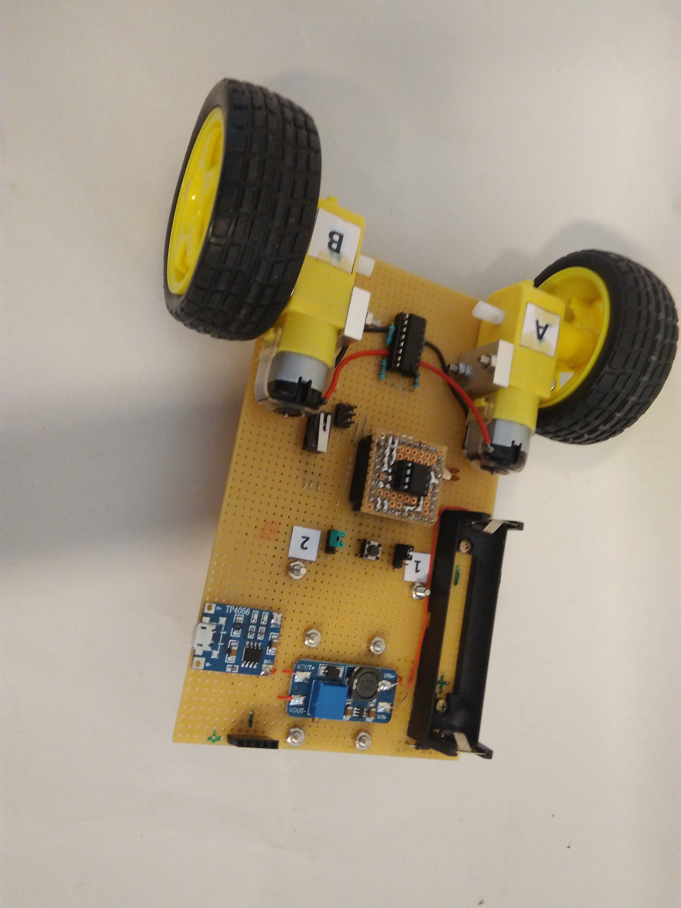

[View Slovak version here](README-sk.md)

## Introduction:

Everybody know [Lego](https://www.lego.com/en-us/) as an campany. They are making most popular Lego sets and robots ever. They have <a href="https://www.lego.com/en-us/mindstorms">Lego NXT and Lego EV3</a> robot sets which are easy to program and build, but after you have learned how to program them with Lego software there isn't any other programing language. So  if you want to learn some other language you have to get something else for example Arduino. Arduino is great platform because it is open source, cheaper than Lego and you aren't that limited. But when you get arduino you will sooner or later realise that you have to know how electronics works. And that's the point where most of people will give up. 
Cing solves this problem because it has a <a href="https://github.com/Galeje/Cing/tree/master/libraries" target= "_blank">Library</a> that allows users to easely program Cing in C language without electronics. We also created pdf <a href="https://github.com/Galeje/Cing/blob/master/CINGtlac.pdf">guide</a>  which teaches you basics of programing <a href="https://github.com/Galeje/Cing" target= "_blank">Cing</a> robot. After learning basics of programing with library they can use <a href="https://github.com/Galeje/Cing" target= "_blank">Cing</a> robot as learning tool for electronics, because it has open source design. That mean that they can program it with Arduino language or avr language.
## Overview:

## Components:
 - ### Procesors:
   - Attiny13 procesor
   - Attiny85 procesor
   - Attiny84 procesor
   - Atmega8 procesor
   - Atmega328 procesor(in progress)
   - Atmega32u4 procesor(in progress)
 - ### Sensors(Inputs):
   - DS18B20 temperature sensor
   - Shine sensor
   - 2 x light sensor
   - ultasonic sensor
 - ### Outputs:
   - L293D
   - Display128x32(in progress)
 - ### Robot parts:
   - Robot body
   - ICSP programmer
   - Li-Ion 18650 battery
   - ICSP ASP programer
 - ### Required tools:
   - Computer
   - Black tape for line
   - Surface for line
   - Obstacle

## Schematic
### Schematic of Atmega328 procesor

### Schematic of Atmega8 procesor

### Schematic of Attiny85 procesor

### Schematic of Cing robot

## Photos
### Assembled

## Support

